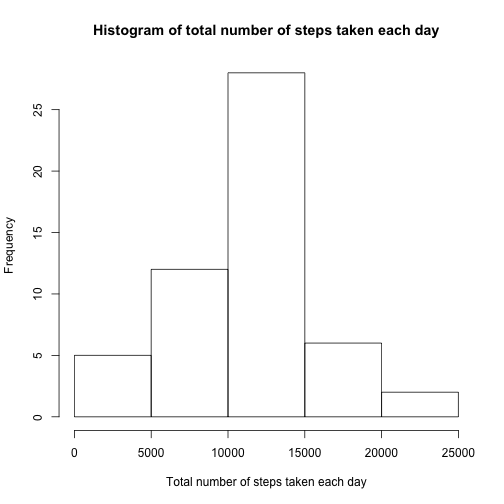
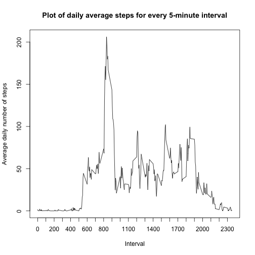
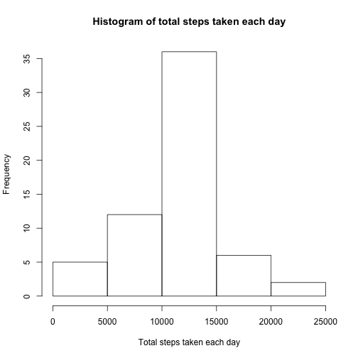
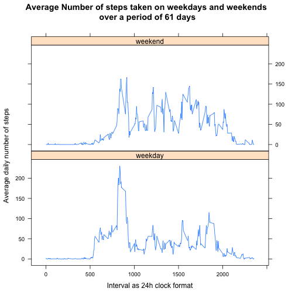

## Loading and preprocessing the data

The activity data in the activity.csv file is read. The data with missing values (NA) are excluded and stored in the variable **activitydata**. The raw data covers a period of 61 days from October 1, 2012 to November 30, 2012.


```r
activityraw <- read.csv(file="activity.csv",head=TRUE,sep=",")
activitydata <- activityraw[complete.cases(activityraw),]
```

## Question 1 - What is mean total number of steps taken per day?
The total number of steps taken per day is calculated across all the intervals per day and stored in the variable **steptotal**. The **steptotal** data consists of 53 rows and 2 columns (date,steps). It can be interpreted that there were missing values for some dates as there are only 53 rows instead of the anticipated 61 dates.

```r
steptotal <- setNames(aggregate(activitydata$steps~activitydata$date,
                                data=activitydata,sum),c("date","steps"))
```

The histogram showing the total number of steps taken each day is plotted. 


```r
hist(steptotal$steps,
     xlab="Total number of steps taken each day", 
     main = "Histogram of total number of steps taken each day")
```

 

The mean and median are also calculated. 

```r
meanQ1 <- round(mean(steptotal$steps),2)
medianQ1 <- round(median(steptotal$steps),2)
```
The mean and median number of steps is 1.076619 &times; 10<sup>4</sup> and 1.0765 &times; 10<sup>4</sup> respectively. 

## Question 2 - What is the average daily activity pattern?

The average number of steps taken every day at a particular interval is calculated using the `aggregate` function. This results in a dataframe of 288 rows and 2 columns (interval, steps).

```r
averageDailySteps <- aggregate(list(averageSteps=activitydata$steps),
                               list(interval=activitydata$interval),mean)
```

There are 288 time intervals in a day starting from 0 to 2355. This time can be interpreted as the 24h clock format, where 20 means 00:20 am (20 minutes past midnight), 100 means 1:00 am, 1200 means 12 noon and 2355 is 11:55 pm. The x-axis is just left as the interval format in the data.

Here is the time series plot of the average number of steps taken at every 5-minute interval over the period of two months.


```r
with(averageDailySteps,plot(interval,averageSteps,
                            type="l",xaxt="n",
                            xlab="Interval",
                            ylab="Average daily number of steps",
                            main="Plot of daily average steps for every 5-minute interval"))
axis(1,at=seq(0,2355,by=100))
```

 


```r
maxinterval <- averageDailySteps$interval[match(max(averageDailySteps$averageSteps),
                                            averageDailySteps$averageSteps)]
```
The 5-minute time interval at which the the average daily steps is maximum occurs at 835 (i.e.At 0835 hours).

## Question 3 - Inputting missing values
The dataset containing the mising values is stored in variable **activityna**. 

```r
activityna <- activityraw[!complete.cases(activityraw),]
nrowsNa <- nrow(activityna)
```
The total number of missing values in the dataset are 2304.

The missing data are replaced with the daily average steps data for each interval. This is calculated in Question 2 previously and it is stored in **averageDailySteps** variable. This is merged with the **activityna** data containing the missing data set. The `NA`s in the dataset are replaced with the mean for that interval.


```r
library(dplyr)
merged <- merge(x=activityna,y=averageDailySteps,by="interval",all.x=TRUE)
activitynaMod <- data.frame(merged$averageSteps, merged$date,merged$interval)
colnames(activitynaMod) <- c("steps","date","interval")
```

A new dataset **activitydataMod** is created using by combining the **activitynaMod** and **activitydata** (referenced in Question 1). Then, it is ordered according to the increasing number of date and interval.

```r
activitydataMod <- rbind(activitydata,activitynaMod)
activitydataMod <- activitydataMod[order(activitydataMod$date,
                                         activitydataMod$interval),]
```

The total number of steps taken each day is calculated and stored in **steptotal2** variable and data from this variable will be used to plot the histogram subsequently.

```r
steptotal2 <- setNames(aggregate(activitydataMod$steps~activitydataMod$date,
                                 data=activitydataMod,sum),c("date","steps"))
```

The histogram showing the total number of steps taken each day is plotted. 

```r
hist(steptotal2$steps,
     xlab="Total steps taken each day", 
     main = "Histogram of total steps taken each day")
```

 

The mean and median are also calculated. 

```r
meanQ3 <- round(mean(steptotal2$steps),2)
medianQ3 <- round(median(steptotal2$steps),2)
```
The mean and median number of steps is 1.076619 &times; 10<sup>4</sup> and 1.076619 &times; 10<sup>4</sup> respectively. 

In comparison with the mean and median in Question1, the mean is the same and the median is increased from 1.0765 &times; 10<sup>4</sup> to 1.076619 &times; 10<sup>4</sup>. The median is now equal to the mean.
Inputing the missing values resulted in median being equal to the mean and with no changes to the mean number of steps.

## Question 4 - Are there differences in activity patterns between weekdays and weekends?
The date variable in the **activitydataMod** dataset is converted to POSIXct format so that the `weekdays()` function can be used. `weekdays()` function results in weekday names from Monday to Sunday for the respective dates. These were replaced to weekday and weekend.  

```r
activitydataQ4 <- mutate(activitydataMod,
                         day=weekdays(as.POSIXct(activitydataMod$date)))

activitydataQ4$day[which(activitydataQ4$day=="Saturday" | 
                           activitydataQ4$day=="Sunday")] <- "weekend"
activitydataQ4$day[which(activitydataQ4$day=="Monday" | 
                           activitydataQ4$day=="Tuesday" | 
                           activitydataQ4$day=="Wednesday" |  
                           activitydataQ4$day=="Thursday"|  
                           activitydataQ4$day=="Friday")] <- "weekday"
```
The `aggregate` function is used to calculate the average number of steps taken for each interval.

```r
activitydataQ4$day <-as.factor(activitydataQ4$day)
averageDailyStepsQ4 <- setNames(
  aggregate(activitydataQ4$steps,
            list(activitydataQ4$interval,activitydataQ4$day),mean),
  c("interval","day","steps"))
```
Using the lattice plot system, a panel plot showing a pattern for the number of steps is plotted for weekday and weekend. 

```r
library(lattice)
xyplot(steps~interval|day, data = averageDailyStepsQ4, 
       type="l",xlab="Interval as 24h clock format",
       ylab="Average daily number of steps",
       main="Average Number of steps taken on weekdays and weekends \nover a period of 61 days",
       layout=c(1,2))
```

 

The maximum value (>200 steps) for the average number of steps taken on a weekday is more than the maximum value  (150-200 steps) for the average number of steps taken on a weekend. This could be attributed to more people going to work on a weekday morning.

However, for a wider amount of interval (between 0500 hrs to 2000 hrs), the average number of steps across the interval is more on a weekend than on a weekday. This could be attributed to more people going out on a weekend and hence, more number of steps is recorded. 
